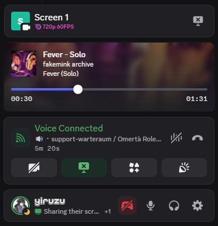

# Vencord CSS Snippets

> [!IMPORTANT]
> Some snippets might break when Discord updates. Don’t worry, fixes will be rolled out shortly afterward.

## `📄`丨Snippets

| Snippet | Description | Image |
| -------- | ------- | ------- |
| [UserActivityRedesign](snippets/UserActivityRedesign/) | Updates the user and activity panels with a fresh design and showcases the Spotify cover art in the player. |  |

## `🛠️`丨Installation

  

Via Local Themes

- Click on the folders (and possibly subsequent folders) of the snippet you want until you see the file `import.css`
- Download the file `import.css` from the folders
- Open Settings > Vencord > Themes > Local Themes > Open Themes Folder
- Paste the downloaded file into the **themes** folder

  

Via Online Themes

- Click on the folders (and possibly subsequent folders) of the snippet you want until you see the file `import.css`
- Click on that file, then click on the **Raw** button
- A file will open on your browser, now copy the URL
- Open Settings > Vencord > Themes > Online Themes
- Paste the following link into **Theme Links**: `URL_HERE`
- Enter or mouse-click outside the Online Themes box to apply

Via QuickCSS

- Click on the folders (and possibly subsequent folders) of the snippet you want until you see the file `import.css`
- Click on that file, then click on the **Raw** button
- A file will open on your browser, now copy the URL
- Open Settings > Vencord > Vencord > Open QuickCSS File
- Paste the following line as your **first line (ahead of any other custom CSS)**: `@import url("URL_HERE");`

## `⭐`丨Special Credits

[SEELE1306](https://github.com/SEELE1306) for the readme and idea
