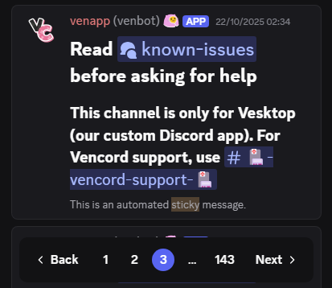
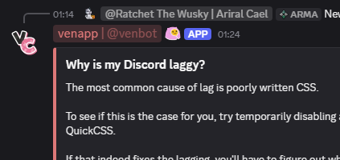

# Vencord CSS Snippets

> [!WARNING]
> Snippets may occasionally break after a new Discord update. Fixes will be released shortly afterward. If the issue persists, please open an issue.

## `📄`丨Snippets

| Snippet | Description | Image |
| ------- | ----------- | ----- |
| <p align="center">[UserActivityRedesign](snippets/UserActivityRedesign/)<br><br>**[Download](https://raw.githubusercontent.com/yiruzu/vencord-snippets/refs/heads/main/snippets/UserActivityRedesign/import.css)**</p> | Revamps the user and activity panels with a twist to the default design and highlights the Spotify cover art in the music player. |  |
| <p align="center">[StickyPager](snippets/StickyPager/)<br><br>**[Download](https://raw.githubusercontent.com/yiruzu/vencord-snippets/refs/heads/main/snippets/StickyPager/import.css)**</p> | Makes the search page selector sticky, so you can always access it while scrolling. |  |
| <p align="center">[BubbleUsernames](snippets/BubbleUsernames/)<br><br>**[Download](https://raw.githubusercontent.com/yiruzu/vencord-snippets/refs/heads/main/snippets/BubbleUsernames/import.css)**</p> | Adds a clean role color matching background to usernames. |  |

## `🛠️`丨Installation

<details>
<summary>With Online Themes</summary>

1. Right-click the **Download** link of the snippet you want and copy its URL.
2. Open **Settings → Themes → [Online Themes]**.
3. Paste the copied link into the input box.

</details>

<details>
<summary>With Local Themes</summary>

1. Click the **Download** link of the snippet you want.
2. Right-click and save the file/page as a `.css` file.
3. Open **Settings → Themes → [Local Themes] → Open Themes Folder**.
4. Move the downloaded file into your `themes` folder.

</details>

<details>
<summary>With QuickCSS</summary>

1. Right-click the **Download** link of the snippet you want and copy its URL.
2. Open **Settings → Themes → [Local Themes] → Edit QuickCSS**.
3. Add this line at the very top (before any other CSS):
   ```css
   @import url("URL_HERE");
   ```

</details>

## `⭐`丨Special Credits

[SEELE1306](https://github.com/SEELE1306) for the readme and idea.
