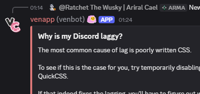

# Bubble Usernames

The screenshots show the snippet with the Vencord “ShowMeYourName” plugin enabled.

| Before | After |
| -------- | -------- |
|  |  |

## `⚙️`丨Configuration

After importing the snippet, copy and paste the code below into your QuickCSS file to configure it.

```css
:root {
  --username-vertical-padding: 0;
  --username-horizontal-padding: 6px;
  --username-radius: 4px;
  --username-plugin-suffix: "| @";
}
```

## `🧩`丨Classes

| Name | Purpose |
| -------- | -------- |
| vc-smyn-suffix | ShowMeYourName Plugin Suffix
| header_c19a55 | Username Header
| username_c19a55 | Username
| convenienceGlowGradient_e5de78 | Gradient Username

## `⭐`丨Credits

- [SEELE1306](https://github.com/SEELE1306) - [Username](https://github.com/SEELE1306/CSS-Snippets/blob/main/Snippets/MessageUltilities/Username)